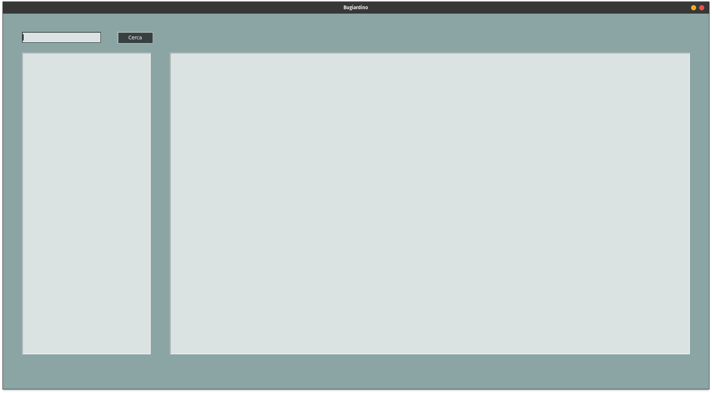
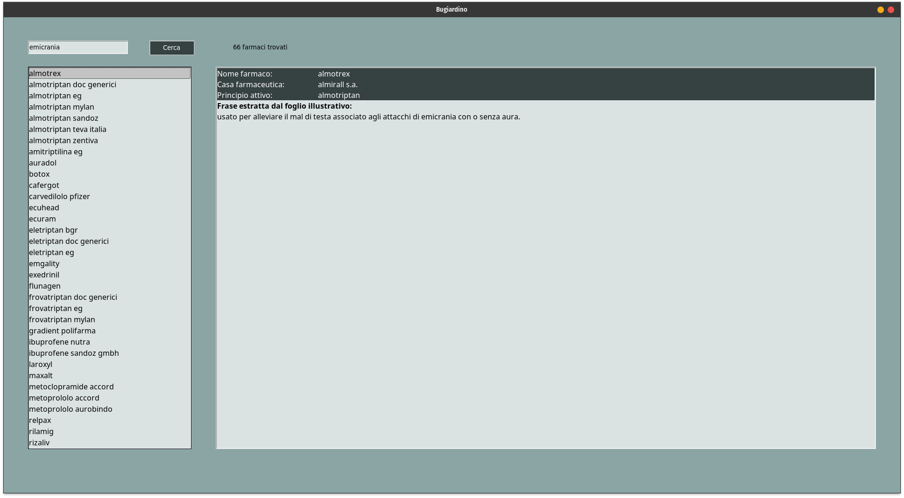

# :pill: Bugiardino

Bugiardino è un programma scritto in Python e Prolog (SWI-Prolog) che permette la ricerca di sintomi/malattie all'interno del foglio illustrativo di oltre 8000 farmaci.

## Raccolta dati

I dati relativi ai fogli illustrativi sono stati raccolti attraverso la [banca dati](https://farmaci.agenziafarmaco.gov) dell'agenzia italiano del farmaco (AIFA). 
Nella banca dati è possibile effettuare tre diversi tipi di ricerca: per farmaco, per principio attivo e per azienda. Quella più rilevante allo scopo del progetto è la ricerca per farmaco. Attraverso diversi tentativi è emerso che per ricavare tutti i farmaci è sufficiente immettere nel campo di ricerca due asterischi **. 
Come risposta alla richiesta si ottiene un json contenente tutti i farmaci che soddisfano i criteri di ricerca (quindi in questo caso tutti i farmaci presenti nella banca dati).

Di tutti i farmaci trovati, non tutti hanno un foglio illustrativo e quindi questi vengono scartati.
Si effettua poi, un ulteriore filtraggio in base allo "schema" del foglio illustrativo. Nel particolare vengono presi solo i fogli illustrativi con uno schema simile a [questo](https://farmaci.agenziafarmaco.gov.it/aifa/servlet/PdfDownloadServlet?pdfFileName=footer_000028_042028_FI.pdf&retry=0&sys=m0b1l3) (quelli con uno schema diverso rappresentano la minoranza, circa 4-500 farmaci su 8500).

Infine, una volta raccolti tutti i dati relativi ai farmaci, questi vengono scritti come fatti nel file `farmaci.pl`.

## Prerequisiti
- Python 3
- SWI-Prolog
- pip

## Installazione
- Clonare il repository
```
git clone https://github.com/alema-r/Bugiardino.git
```
- Spostarsi nella directory del progetto
```
cd Bugiardino
```
- Installare i requisiti
```
pip install -r requirements.txt
```

Nota: è possibile (ma non necessario per il funzionamento del programma) effettuare nuovamente la fase di raccolta dati utilizzando il comando
```
python3 raccolta_dati.py
```
Tenere conto che l'operazione richiederà parecchio tempo (circa 3 ore).

## Utilizzo
Eseguire il programma attraverso il comando:
```
python3 gui.py
```
(Questo richiede alcuni secondi per l'avvio)

All'avvio si presenterà la seguente schermata: 

Inserire la malattia o il sintomo nel riquadro di ricerca e premere invio (o il bottone Cerca). La ricerca può essere composta da più parole.
La colonna di sinistra verrà popolata con tutti i farmaci che soddisfano la ricerca. Cliccando su uno di essi nella colonna di destra verranno mostrate le informazioni relative al farmaco e la frase (o le frasi) del foglio illustrativo che contengono la parola ricercata: 

## :warning: Importante
Il programma è stato scritto a solo scopo didattico. Prima di assumere qualsiasi farmaco è importante contattare il proprio medico.
